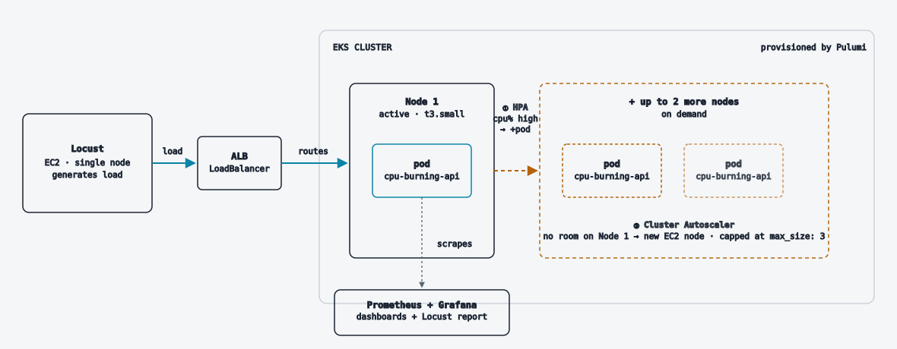

# kubernetes-qa-performance-lab

Kubernetes testing lab for API deployment, performance testing, autoscaling, CI/CD, observability, and failure diagnosis. Uses Locust to generate load and intentionally introduces application, deployment, networking, and resource failures to practice debugging and recovery.

## Architecture

A single EC2 instance runs [Locust](https://locust.io) and sends HTTP load at [`cpu-burning-api`](api/) (a FastAPI service that deliberately burns CPU/memory per request), running on an [EKS](https://aws.amazon.com/eks/) cluster.

1. Locust ramps virtual users against the ALB's DNS name.
2. The ALB routes each request to a pod running `cpu-burning-api` on Node 1.
3. As pod CPU rises, the Horizontal Pod Autoscaler (HPA) adds more pods.
4. Once pods no longer fit on Node 1, Cluster Autoscaler adds EC2 nodes — capped at 3.
5. Prometheus scrapes pod and Locust metrics; Grafana renders the results as dashboards.

All infrastructure (VPC, EKS cluster, node group, ECR, and the Locust EC2 instance) is defined in [`infra/`](infra/) with [Pulumi](https://www.pulumi.com/), so the whole environment can be brought up and torn down with `pulumi up` / `pulumi destroy`.
